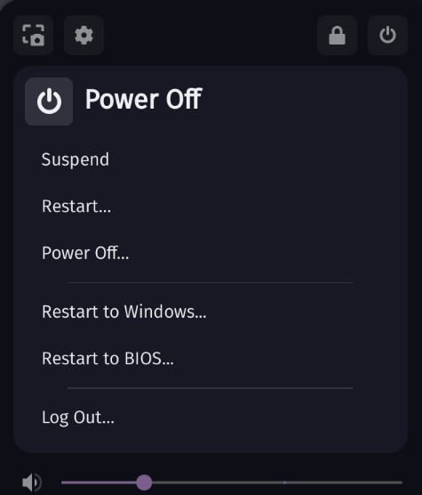

**This is a fork of https://github.com/jusnim/rebootintowindows**

# Reboot into UEFI/Windows from Gnome Power menu with SystemD

This is a small Gnome extension that adds the ability to reboot directly into Windows or UEFI with SystemD.

 

### Build and install the extension

Requirements:

- Nix package manager

To enter development shell please run:

`$ nix develop .`

To build the extension run the following command:

`$ make pack`

If all goes well this will generate a zip file in the project folder.

To install the extension just run the following command:

`$ make install`
