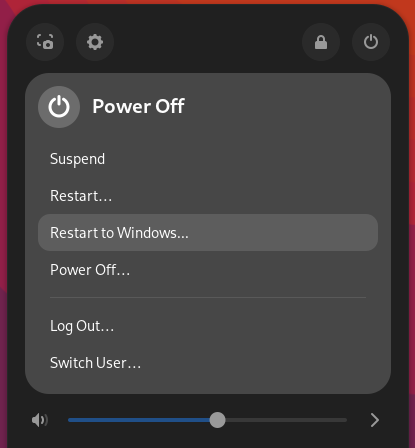

**This is a fork of https://github.com/UbayGD/reboottouefi**

# Reboot into Windows with GRUB

This is a small Gnome extension that adds the ability to reboot directly into Windows with GRUB.

 

### Build and install the extension

Requirements:

- make
- nodejs and npm
- gettext

To build the extension run the following command:

`$ make pack`

If all goes well this will generate a zip file in the project folder.

To install the extension just run the following command:

`$ make install`
